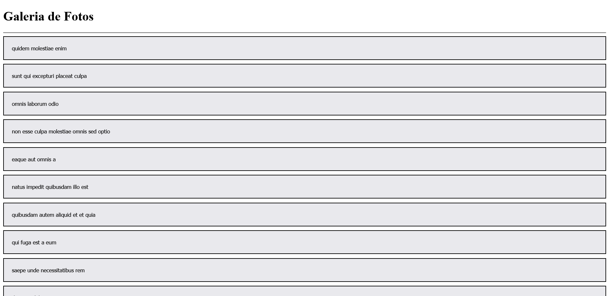

# React-router-dom

## Overview

### Screenshot

### Links

-   Solution URL: Working on it

## My process

### Built with

-   Semantic HTML5 markup
-   CSS custom properties
-   JavaScript
-   ReactJS

### What I learned

In this project i could use the axios library to make HTTP requests from a fake API and navigate though it's data with the resources of the React-router-dom library.

## Author

-   GitHub - Vinícius dos Santos Verissimo (https://github.com/viniciusdsv93)
